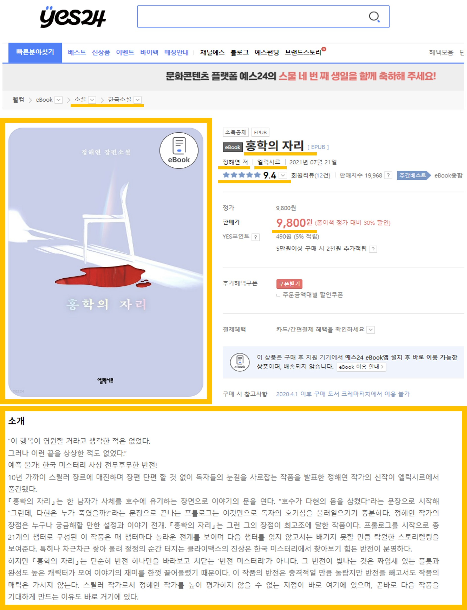
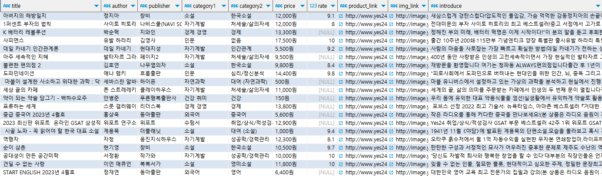

# **📖eBook 추천 시스템 구현📖**
------
## **📝프로젝트 개요**
- 우리나라 전자책 시장은 다른나라들에 비해 작은 규모였으나, 코로나 19 확산 이후 전자책을 찾는 사람들이 많아졌고 디지털이 발전하면서 이제는 ebook의 시대라고 한다. 때문에 사람들이 eBook을 잘 활용할 수 있도록 자신이 선호하는 도서의 유사도서 추천 시스템을 만들고자 한다.
- 컨텐츠 기반 필터링 기법을 활용하여 도서의 저자명, 출판사, 대분류, 소분류와 책소개글에 대해 TF-IDF 벡터화 후 코사인 유사도를 구해 자신이 검색한 도서와 유사한 도서 12개를 출력하는 시스템입니다.
    
    > **컨텐츠 기반 필터링 기법** : 컨텐츠의 특징을 분석하여 유사성을 계산하는 것으로, 사용자의 과거 행동 데이터가 필요하지 않음.
    
    > **TF-IDF 벡터화** : 문서의 특징을 나타내는 벡터를 생성하는 방법 중 하나로, 각 단어의 중요도를 계산하는 방법. 문서에서 자주 나타나는 단어는 해당 문서를 특징짓는 중요한 단어로 간주되며, 다른 문서에서 자주 나타나는 단어는 해당 문서의 특징과 관련성이 낮은 단어로 간주함.
------
## **💻사용 기술**
- 

------
## **📂사용 데이터**
- YES24의 eBook 종합 베스트셀러 도서 897권에 대한 10가지 정보

    1. 도서명
    2. 저자명
    3. 출판사명
    4. 중분류
    5. 소분류
    6. 가격
    7. 평점
    8. 도서 소개 글
    9. 판매 링크
    10. 도서 이미지 링크
------
## **➡️진행 과정**
------
### **1) 크롤링**
- request, beautifulsoup 라이브러리를 이용하여 YES24의 eBook 종합 베스트셀러 도서 897권에 대한 10가지 정보 크롤링

    

### **2) DB에 데이터 저장**
- 클라우드 데이터베이스(ElephantSQL with PostgreSQL)에 크롤링한 데이터 저장
    
    
    
### **3) 데이터 전처리**
- 도서에 대한 컨텐츠(소개글, 저자명, 출판사, 대분류, 소분류)를 하나로 합치기
- 특수문자 제거
- NULL값 빈칸으로 채우기
- TfidfVectorizer를 이용한 벡터화
   
### **3) 유사도 계산**
- 입력된 도서의 인덱스를 가져오기
- 코사인 유사도 계산
- 모든 도서에 대해 해당 도서와의 유사도 계산 후 리스트로 저장
- 유사도에 따라 도서들을 내림차순 정렬
- 가장 유사도가 높은 도서 12개의 인덱스 가져오기
- 인덱스에 해당하는 도서 리스트 반환

### **3) Flask 웹페이지 구현**
- 검색을 위한 main 페이지
    - 검색창에 검색할 도서 타이핑 시 검색 가능한 도서 확인 가능
- 유사도 기반 추천 도서 12개를 출력해주는 result 페이지
    - 추천 도서의 이미지, 도서명, 저자명, 출판사, 카테고리, 가격, 평점 출력
    - 도서 이미지나 도서명을 클릭하면 구매 사이트로 이동
    - 이미지에 마우스를 올리면 소개글 확인 가능

---
## **📌최종 결과 시연**

---
## **✍️추후 도전 및 개선하고 싶은 점**
- 더 많은 책 데이터 크롤링
- 사용자 기반 추천 시스템 구현
- 웹사이트 배포

